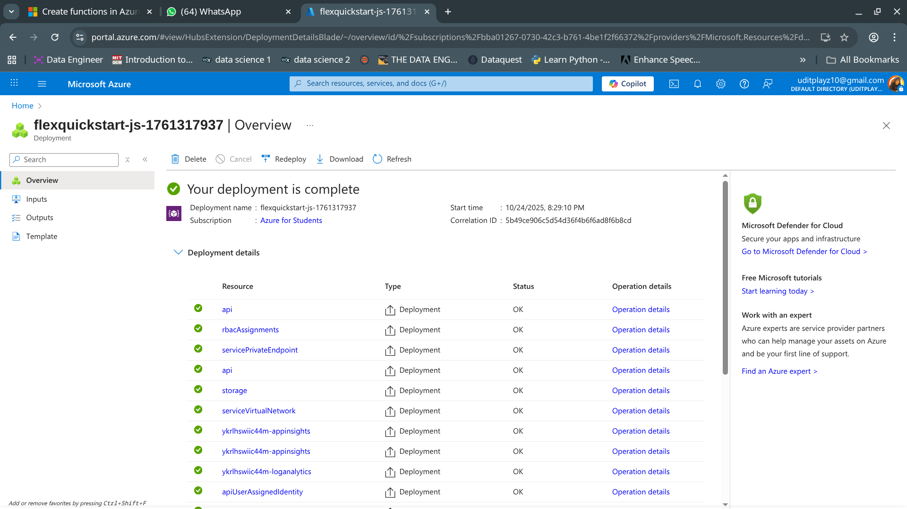
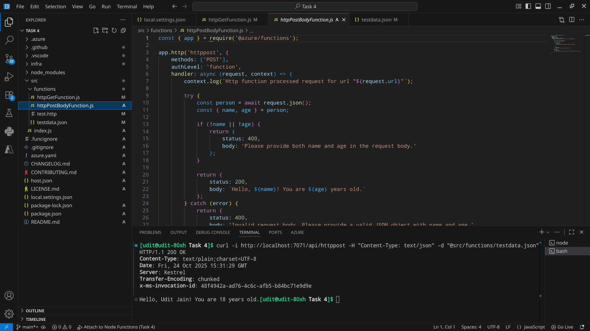
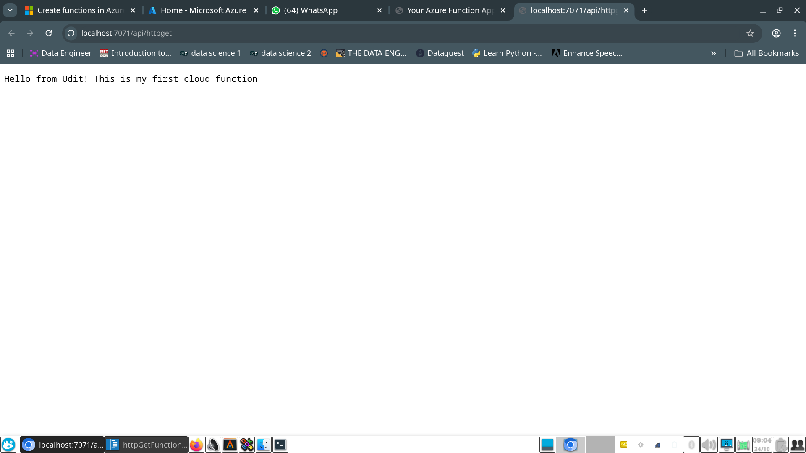

# Task 4: Deploy a serverless function to the cloud

I have deployed the serverless function on Microsoft Azure

## Azure Functions JavaScript HTTP Trigger using Azure Developer CLI

This repository contains an Azure Functions HTTP trigger reference sample written in JavaScript and deployed to Azure using Azure Developer CLI (`azd`).

This source code supports the article [Quickstart: Create and deploy functions to Azure Functions using the Azure Developer CLI](https://learn.microsoft.com/azure/azure-functions/create-first-function-azure-developer-cli?pivots=programming-language-javascript).

## Source Code

The source code for the GET and POST functions is in the [`httpGetFunction.js`](./src/functions/httpGetFunction.js) and [`httpPostBodyFunction.js`](./src/functions/httpPostBodyFunction.js) code files, respectively. Azure Functions requires the use of the `@azure/functions` library.

## Endpoint URL: https://func-api-icaaq7hki4ofa.azurewebsites.net/ 

## Screenshots

